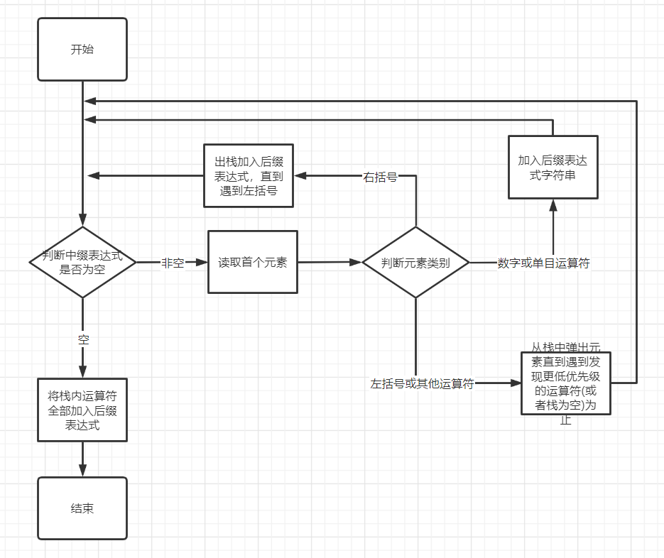
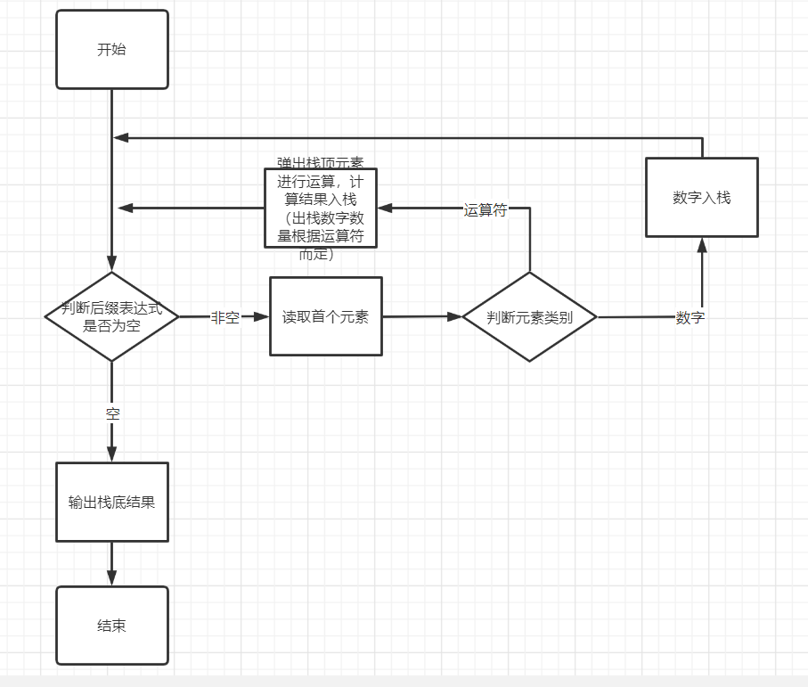
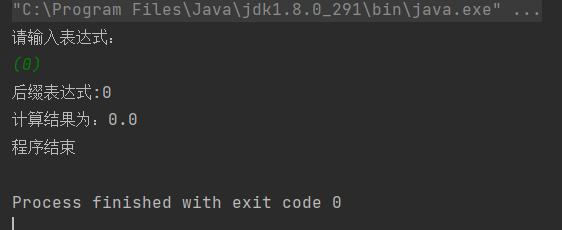
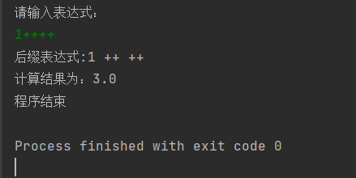
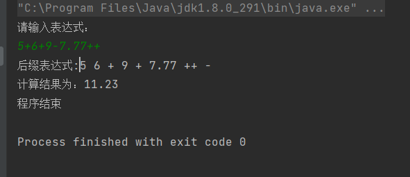
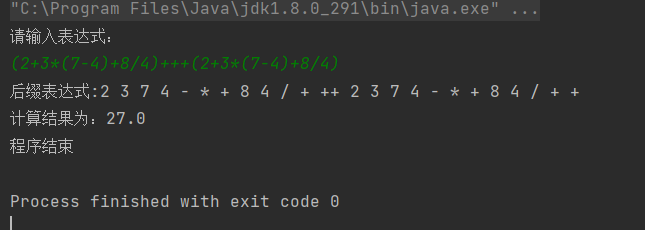
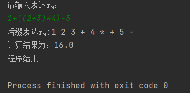
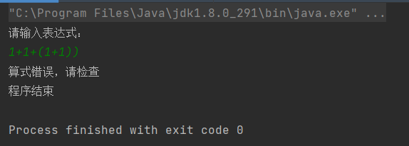

# Infix-expression
计算中缀表达式（包含＋＋、－－单目运算符），将中缀表达式转换为后缀表达式，再进行计算

## 问题描述

从键盘上输入中缀算术表达式，包括括号，计算出表达式的值。

## 基本要求

（1）程序能对所输入的表达式作简单的判断，如表达式有错，能给出适当的提示。

（2）能处理单目运算符：+，-。

## 解题

### 思路

首选检查算式格式，算式正确的话，将中缀表达式转换为后缀表达式进行计算。转换与计算流程图如下

转换：



计算后缀表达式：



### 运算符优先级

| 优先级 | 符号   |
| ------ | ------ |
| 一     | （、） |
| 二     | ++、-- |
| 三     | *、/   |
| 四     | +、-   |

### 程序源码

```java
//Main.java
package com.company;

import java.util.Scanner;

public class Main {

    public static void main(String[] args) {
        System.out.println("请输入表达式：");
        Scanner input = new Scanner(System.in);

        //读取中缀表达式
        String zhongZhui = input.next();
//        String zhongZhui = "++";
//        String zhongZhui = "5+6+9-7.77++";
//        zhongZhui = "2+3*(7-4)+8/4";
//        zhongZhui = "(2+3*(7-4)+8/4)+++(2+3*(7-4)+8/4)";
//        zhongZhui = "1+((2+3)*4)-5";

        if (Proc.check(zhongZhui)) {  //转为后缀表达式
            String houZhui = Proc.transfor(zhongZhui);
            //计算
            System.out.println("计算结果为：" + Proc.compute(houZhui));
        } else {
            System.out.println("算式错误，请检查");
        }
        System.out.println("程序结束");
        return;
    }
}

```

```java
//Proc.java
package com.company;

public class Proc {
    //检查中缀表达式格式
    public static boolean check(String zhongzhui) {
        int state = 0;//记录状态(0:”(“或数字；1：运算符或“)”)
        int n1 = 0;//判断括号对应
        String item = "";
        zhongzhui = zhongzhui.trim();
        while (!zhongzhui.equals("")) {
            item = getFirstNumOrOperator(zhongzhui);
            if (item.equals("error")) {
                return false;
            }
            if (state == 0) {
                if (!(item.equals("(") || (item.charAt(0) >= '0' && item.charAt(0) <= '9'))) {
                    return false;
                }
                if (item.equals("(")) {
                    n1++;
                    state = 0;
                } else {
                    state = 1;
                }
            } else {

                if (state == 1) {
                    if (!(item.equals(")") || item.equals("+") || item.equals("-")
                            || item.equals("*") || item.equals("/")
                            || item.equals("++") || item.equals("--"))) {
                        return false;
                    }
                    if (item.equals(")")) {
                        n1--;
                        state = 1;
                        if (n1 < 0) {
                            return false;
                        }
                    }
                    if (item.equals("++") || item.equals("--")) {
                        state = 1;
                    }
                    if (item.equals("+") || item.equals("-") || item.equals("*") || item.equals("/")) {
                        state = 0;
                    }
                }
            }

            zhongzhui = zhongzhui.substring(item.length());
            zhongzhui = zhongzhui.trim();
        }

        if (state != 1 || n1 != 0) {
            return false;
        }

        return true;
    }


    //    中缀表达式转化后缀表达式
    public static String transfor(String zhongzhui) {
        //清除头尾空格
        String item = "";
        String houzhui = "";
        OpStack opStack = new OpStack();
        while (!zhongzhui.equals("")) {
            zhongzhui = zhongzhui.trim();
            item = getFirstNumOrOperator(zhongzhui);
//            System.out.println(item);
            if (item.equals("error")) {
                System.out.println("出现错误，请检查表达式");
                return "error";
            }
            if (item.charAt(0) >= '0' && item.charAt(0) <= '9') {
                houzhui += item;
                houzhui += ' ';
            }
            if (item.equals("++") || item.equals("--")) {
                houzhui += item;
                houzhui += ' ';
            }
            if (item.equals("(") || item.equals(")") || item.equals("+")
                    || item.equals("-") || item.equals("*") || item.equals("/")) {
                //出栈
                if (item.equals("(")) {
                    opStack.push('(');
                }
                if (item.equals(")")) {
                    while (!opStack.empty() && opStack.peek() != '(') {
                        houzhui += opStack.pop();
                        houzhui += ' ';
                    }
                    if (opStack.peek() == '(') {
                        opStack.pop();
                    }
                }
                if (item.equals("+") || item.equals("-")) {
                    while (!opStack.empty() && opStack.peek() != '(') {
                        houzhui += opStack.pop();
                        houzhui += ' ';
                    }
                    opStack.push(item.charAt(0));
                }
                if (item.equals("*") || item.equals("/")) {
                    while (opStack.peek() != '$' && (opStack.peek() == '*' || opStack.peek() == '/')) {
                        houzhui += opStack.pop();
                        houzhui += ' ';
                    }
                    opStack.push(item.charAt(0));
                }
            }
            zhongzhui = zhongzhui.substring(item.length());
            zhongzhui = zhongzhui.trim();
        }
        while (!opStack.empty()) {
            houzhui += opStack.pop();
            houzhui += ' ';
        }
        System.out.println("后缀表达式:" + houzhui);
        return houzhui;
    }

    //计算后缀表达式
    public static double compute(String houzhui) {
        if (houzhui.equals("error")) {
            System.out.println("错误");
            return 0;
        }

        double output = 0;
        NumStack numStack = new NumStack();
        String item = "";
        while (!houzhui.equals("")) {
            houzhui = houzhui.trim();
            item = getFirstNumOrOperator(houzhui);

            if (item.equals("error")) {
                System.out.println("出现错误，请检查表达式");
                return -1;
            }
            if (item.charAt(0) >= '0' && item.charAt(0) <= '9') {
                numStack.push(new Double(item));
            }
            if (item.equals("++")) {
                numStack.push(numStack.pop() + 1);
            }
            if (item.equals("--")) {
                numStack.push(numStack.pop() - 1);
            }
            if (item.equals("+")) {
                numStack.push(numStack.pop() + numStack.pop());
            }
            if (item.equals("-")) {
                numStack.push(-numStack.pop() + numStack.pop());
            }
            if (item.equals("*")) {
                numStack.push(numStack.pop() * numStack.pop());
            }
            if (item.equals("/")) {
                numStack.push(1 / numStack.pop() * numStack.pop());
            }
            houzhui = houzhui.substring(item.length());
            houzhui = houzhui.trim();
        }
        return numStack.pop();
    }

    //取式子中下一个运算符或数字
    private static String getFirstNumOrOperator(String str) {
//        System.out.println("字符串：" + str);
        str = str.trim();
        if (str.equals("")) {
            return "error";
        }
        String item = "";
        int i = 0;
        char ch = str.charAt(i);
        if (ch >= '0' && ch <= '9') {
            for (i = 0; i < str.length(); i++) {
                ch = str.charAt(i);
                if ((ch >= '0' && ch <= '9') || ch == '.') {
                    item += ch;
                } else {
                    break;
                }
            }
            int nofdot = 0;
            for (int i1 = 0; i1 < item.length(); i1++) {
                if (item.charAt(i1) == '.') {
                    nofdot++;
                }
            }
            if (nofdot > 1) {
                return "error";
            }
            return item;
        }
        if (ch == '+' || ch == '-') {
            if (str.length() > 1 && str.charAt(1) == ch) {
                item += ch;
                item += ch;
                return item;
            }
        }
        if (ch == '(' || ch == ')'
                || ch == '*' || ch == '/'
                || ch == '+' || ch == '-') {
            item += ch;
            return item;
        }
        return item;
    }
}
```

```java
//OpStack.java
package com.company;


public class OpStack {
    char[] stack = new char[100];
    int length = 0;

    //    判断是否为空
    public boolean empty() {
        if (length == 0) return true;
        return false;
    }

    //    取栈顶值（不出栈）
    public char peek() {
        if (length == 0) {
            return ' ';
        }
        return stack[length - 1];
    }

    //    进栈
    public char push(char op) {
        stack[length] = op;
        length++;
        return op;
    }

    //    出栈
    public char pop() {
        if (length == 0) {
            return ' ';
        }
        length--;
        char op = stack[length];
        return op;
    }

}
```

```java
//NumStack.java
package com.company;


public class NumStack {
    double[] stack = new double[100];
    int length = 0;

    //    判断是否为空
    public boolean empty() {
        if (length == 0) return true;
        return false;
    }

    //    取栈顶值（不出栈）
    public double peek() {
        if (length == 0) {
            return ' ';
        }
        return stack[length - 1];
    }

    //    进栈
    public double push(double num) {
        stack[length] = num;
        length++;
        return num;
    }

    //    出栈
    public double pop() {
        if (length == 0) {
            return ' ';
        }
        length--;
        double num = stack[length];
        return num;
    }
}
```

### 运行结果












